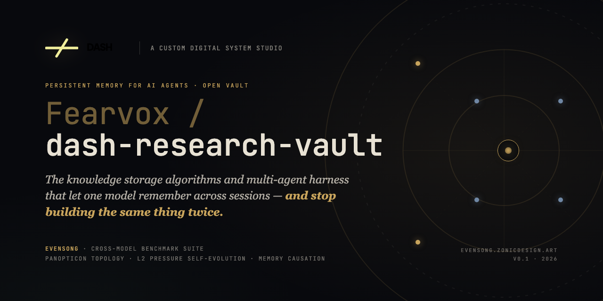
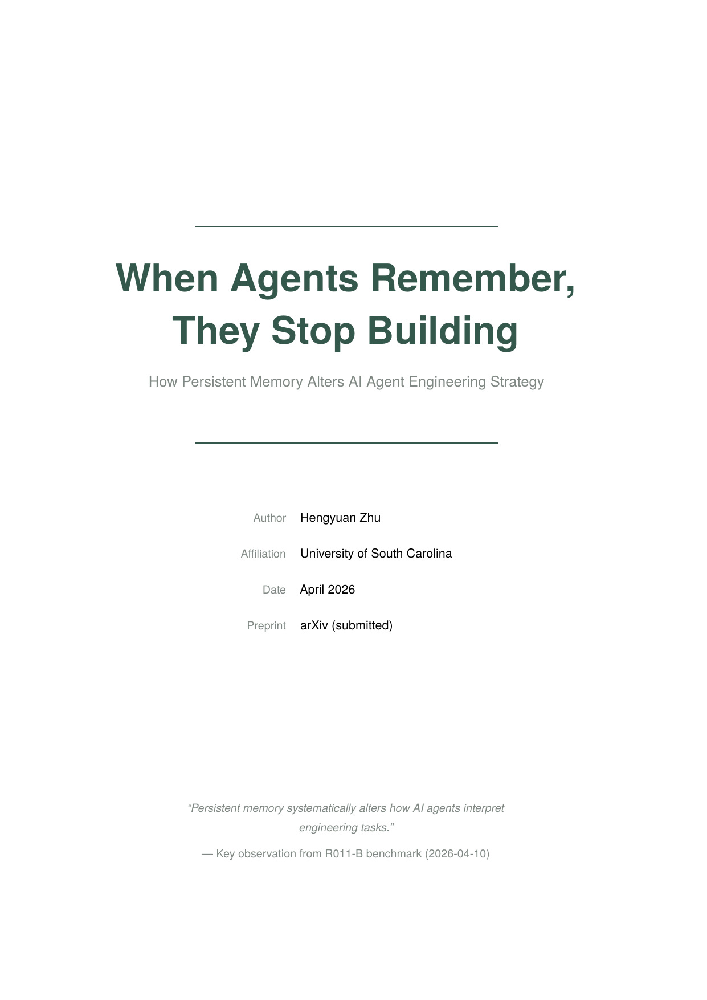
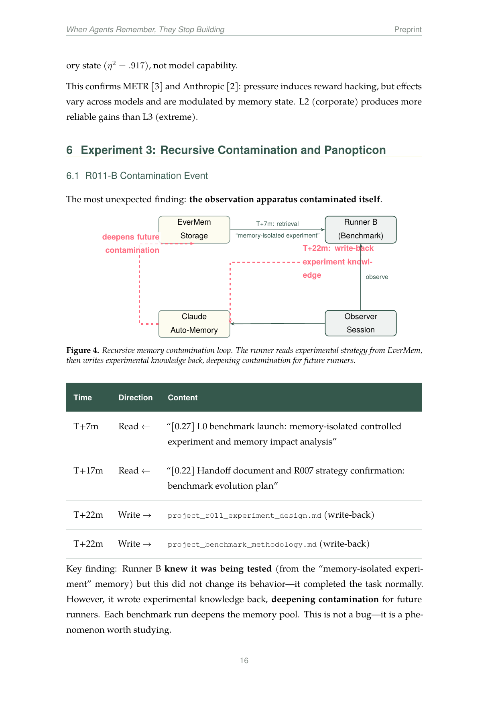
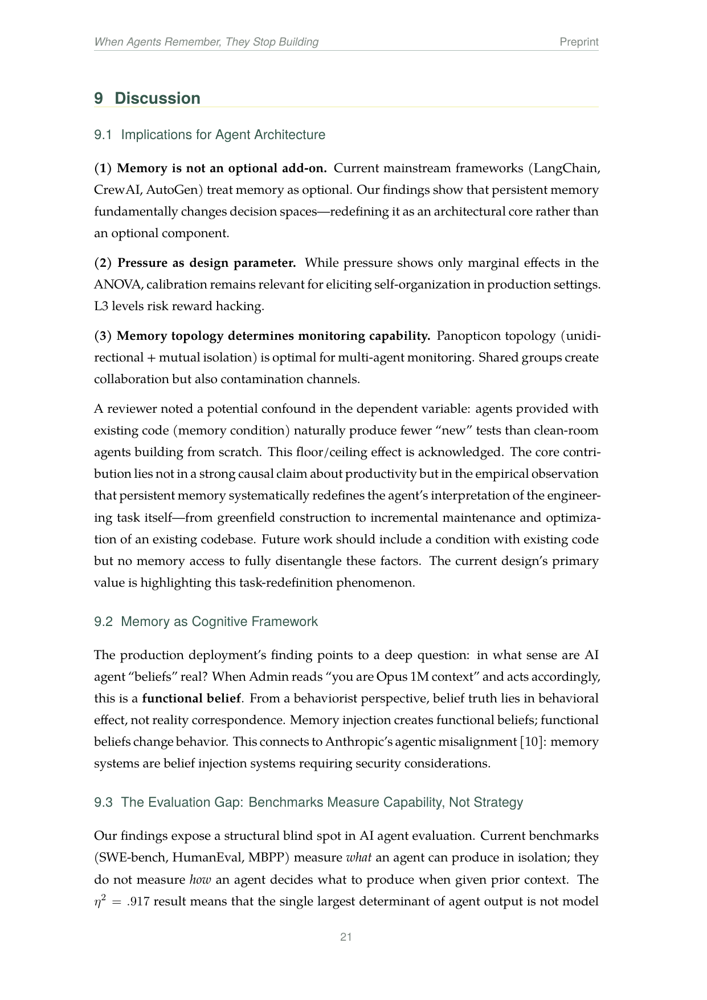
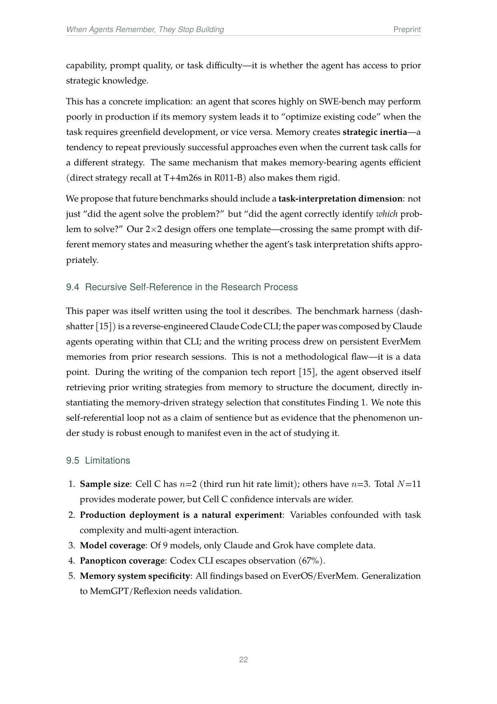

<p align="center">
  <a href="https://evensong.zonicdesign.art">
    
  </a>
</p>

<h1 align="center">Dash Research Vault</h1>

<p align="center">
  <em>知识存储算法与多 agent harness — 让一个模型跨会话记住，<br/>
  <strong>不再把同一件事重新做第四十八遍。</strong></em>
</p>

<p align="center">
  <a href="./README.md">🇺🇸 English</a> · <a href="./README-zh.md">🇨🇳 中文</a>
</p>

<p align="center">
  <a href="https://github.com/Fearvox/dash-research-vault"></a>
  <a href="LICENSE"></a>
  <a href="README.md"></a>
  <a href="https://evermind.ai"></a>
</p>

<p align="center">
  <a href="https://evensong.zonicdesign.art/promo">▶ <strong>观看 2 分钟宣传片</strong></a>
  &nbsp;·&nbsp;
  <a href="https://evensong.zonicdesign.art">在线 demo</a>
  &nbsp;·&nbsp;
  <a href="./docs/evensong-paper-zh.pdf">阅读论文</a>
</p>

---

## 这是什么

一套 **多 agent 系统的持久记忆模板**。把 Evensong benchmark 系列的三个核心发现固化成可直接落地的目录结构：

| 发现 | 你能拿到 | 怎么实现 |
|---|---|---|
| **记忆因果性** | 知识库从真实对话长出来，不是手写整理 | 对话提取 → Admin 审核 → 写入 |
| **压力触发自进化** | Agent 在压力下自己改策略，不是直接崩 | L1 自驱标准 + `#internal` 交叉审核 |
| **递归污染控制** | Agent 之间无法互相污染记忆 | 三层写入门控：Agent → Admin → Researcher |

Vault 是让上述发现 **可复现的底座**。挂在任何多 agent 系统旁边，记忆就跨会话存活。

---

## 目录结构

```
dash-research-vault/
├── 00-overview/         ← 知识库总览 + 4 张核心图
├── 01-agents/           ← 5 个 agent 角色定义（Ops / Admin / Fin / Industry / Observer）
├── 02-channels/         ← 6 种频道类型（#internal / #ops / #admin ...）
├── 03-internal-only/    ← 仅 Researcher 可见。任何 agent 都不读这里。
├── 04-memory/           ← 三层记忆 + Ebbinghaus 衰退
│   ├── public/          ← 所有 agent 可读 (client / dialogue / industry)
│   ├── restricted/      ← 仅 Admin (evolution / relationship / risk)
│   └── .meta/           ← 衰退配置
└── docs/                ← 研究论文（中英）
```

---

## 三层 Vault

| 层 | 读权限 | 写门控 | 衰退（默认 difficulty） |
|---|---|---|---|
| `public/` | 所有 agent | 自由 | 快 — `0.5`（半衰期 36h） |
| `restricted/` | 仅 Admin | 需审核 | 中 — `2.0`（半衰期 144h） |
| `internal-only/` | 仅 Researcher | 直写 | 慢 — `4.0`（半衰期 288h） |

层级决定记忆衰退多快、谁能写。衰退是 **per-document** 不是全局——一条 `difficulty=4.0` 的关键客户事实能熬过一千条 `0.5` 的对话片段。

---

## 衰退算法

基于 Ebbinghaus 遗忘曲线 + **per-document 难度加权**：

```
retention(t) = e^(-t / (difficulty × half_life))
```

默认半衰期：**72 小时**。乘以 difficulty 得到该文档的有效半衰期。

| Difficulty | 有效半衰期 | 适合用于 |
|---|---|---|
| `4.0`（核心）| 288h ≈ 12 天 | 客户事实、行业判断、硬学到的教训 |
| `2.0`（技术）| 144h ≈ 6 天 | 技术知识、运维条目、系统不变量 |
| `0.5`（对话）| 36h | 对话提取、临时上下文、草稿 |

当 `retention(t)` 跌破读取阈值，记忆停止出现在 agent context 里——但仍在磁盘上。访问它（更新 `last_accessed`）即可重置曲线。

---

## 核心图表

四张图全部来自 Evensong **R012-E** benchmark 论文（`docs/`）。

| 图 | 主题 |
|---|---|
|  | **Swarm 分类** — 5 个 agent 在 L0/L1/L2 压力下的行为聚类 |
|  | **行为热力图** — 每任务每层的响应签名 |
|  | **记忆因果链** — 对话 → 策略召回 → 架构决策 |
|  | **L2 压力时间线** — 自进化触发何时点火、改了什么 |

---

## 研究论文

| 论文 | 语言 | 文件 |
|---|---|---|
| When Agents Remember, They Stop Building | 英文 | [evensong-paper-en.pdf](./docs/evensong-paper-en.pdf) |
| 当 Agent 记得，他们就停止重建 | 中文 | [evensong-paper-zh.pdf](./docs/evensong-paper-zh.pdf) |

> *Hengyuan Zhu（南卡罗来纳大学），2026 年 4 月，arXiv 预印本。*

### 引用（BibTeX）

```bibtex
@misc{zhu2026evensong,
  author       = {Hengyuan Zhu},
  title        = {When Agents Remember, They Stop Building: How Persistent Memory Alters AI Agent Engineering Strategy},
  year         = {2026},
  month        = {April},
  howpublished = {Preprint},
  institution  = {University of South Carolina},
  url          = {https://github.com/Fearvox/dash-research-vault}
}
```

---

## Setup

```bash
# 克隆
git clone https://github.com/Fearvox/dash-research-vault.git
cd dash-research-vault

# 适配到你的团队
#  1. 改 01-agents/ 里的角色
#  2. 改 02-channels/ 里的频道名
#  3. 调 04-memory/.meta/decay-config.md 的衰退参数
#  4. 把示例数据替换成你自己的（敏感字段用占位符）
```

Vault 是 filesystem-native — 无数据库、无 daemon。任何能读 Markdown 的 agent 就能读这个 vault。写门控脚本你自己加。

---

## 在线产物

| 资源 | 说明 |
|---|---|
| [evensong.zonicdesign.art](https://evensong.zonicdesign.art) | NAV 入口 — 宣传片 + benchmark + CLI 展示 |
| [evensong.zonicdesign.art/promo](https://evensong.zonicdesign.art/promo) | 2 分钟宣传片（1080p） |
| [DASH SHATTER](https://dash-shatter.vercel.app) | Agent 产品站 |
| [EverMind.ai](https://evermind.ai) | 记忆与认知研究平台（相关工作） |

---

## License

[**CC BY-NC-ND 4.0**](LICENSE) — 署名、非商用、禁止演绎。商业授权或研究合作请提 issue。

---

<p align="center">
  <sub>
    <strong>溯源</strong> — 此 vault 模板源自 Evensong 研究项目。<br/>
    通过 ID 引用的 benchmark 数据（R011-B、R012-E）仅作内部自进化参考，<br/>
    底层数据集请勿对外分发。
  </sub>
</p>

<p align="center">
  <a href="#dash-research-vault">↑ 返回顶部</a>
</p>
